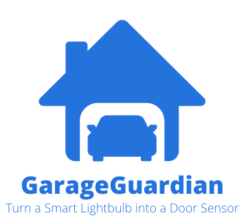

# GarageGuardian

How many hackers does it take to screw in a lightbulb?

Garage Guardian is a cloud-based solution to monitor the state of your garage door using a Tuya-enabled smart bulb. You replace the bulb that's likely already in your garage opener with a WiFi smart bulb, and then it keeps track of its on/off state to tell you when your garage door is open or closed - no hardware hacking or modification required. Recall how that bulb turns on and off as the opener is used- this lets us keep track of open and close events. If you're like me and reguarly drive around the block to double check it's closed, rejoice! This project uses AWS services like Lambda, DynamoDB, API Gateway, and Secrets Manager to provide real-time garage door status updates to a simple website you can bookmark on your phone.

## Features
- Keeps track if your garage door is open or closed by getting the status of your smart bulb installed in the opener once every minute. Close/open events can then be tracked in its built-in database to ensure that you have accurate statusing on your garage door!
- Deploys with a single click to Amazon Web Services, no coding required
- Includes a bookmarkable status page you can check on the go

## Prerequisites
- A Tuya-compatible WiFi smart bulb ([I used these, but others likely work](https://a.co/d/7PNa9o0))
- An Amazon Web Services account
- A garage door opener that has a built-in lightbulb

## Setup Instructions

### 1. Install your lightbulb
1. Install the Tuya Smart app and sign up for an account [iOS](https://apps.apple.com/us/app/tuya-smart/id1034649547), [Android](https://play.google.com/store/apps/details?id=com.tuya.smart&hl=en-US)
2. Safely set up a ladder under your garage door opener (unless you're tall enough to reach it, I suppose)
3. Open the front of the unit where the lightbulb can be replaced. On mine this part of the case is on a hinge and simply flips up.
4. Remove the light bulb
5. Install your Tuya WiFi bulb
6. Close the case
7. Open and close the garage door to turn the bulb on
8. Click "Add Device" in the Tuya Smart App and follow prompts to add the smart bulb to your account
9. Verify you can change the bulb color or turn it on and off before continuing. This confirms the bulb is connected to your WiFi and registered correctly with your Tuya account.

### 2. Get Your Tuya API Credentials
1. Go to the [Tuya IoT Platform](https://iot.tuya.com/).
2. Log in or sign up for an account. This website does **not** use the same credentials as your Tuya Smart app account. We will link them later.
3. Navigate to the **Cloud** section.
4. Click on **Create Cloud Project** and follow these steps:
   - Name your project whatever you choose
   - Choose **Smart Home** as the industry and development method type type.
   - Select the appropriate data center for your region. This should be the closest to your physical location where your garage door opener is installed. [Use this table to find the right data center for you](https://github.com/tuya/tuya-home-assistant/wiki/Countries-Regions-and-Tuya-Data-Center)
   - Click 'Create'
   - On the 'Authorize API Services' window, ensure you have 'IoT Core' and 'Authorization Token Management' in your selected API services. They may have been added by default.
   - Click 'Authorize'
5. From the 'Overview' section you can copy and save your 'Access ID' and 'Authorization Key'. They will be needed in later steps.
6. From the top navigation bar select 'Devices'
7. From this new page, in the new navigation bar that appeared below the top navigation bar select 'Link Tuya App Account'
8. Click the 'Add App Account' button
9. Keep the default selections of 'Automatic Link' and read permissions selected
10. In the Tuya Smart app, click the add button again (+) and click 'Scan'. Scan the QR code the Tuya IoT Platform is displaying. Your account will be linked automatically. If it complains about the data center you selected, repeat these steps with a different data center that may be closer to your present location.
11. You should see a list of devices that includes your new smart lightbulb. Copy its **Device ID**. You will need it in the next section.

### 3. Deploy the CloudFormation Stack
**Imporant!** Close your garage door and wait for the light to turn off before completing this section. The Lambda function this deploys checks the bulb status once every minute and tracks opening and closing events based on if the bulb is currently online. The statusing code assumes the door starts in the closed and bulb off state.

1. Click "Launch Stack" below. This will launch a CloudFormation stack with the Garage Guardian code after we configure a few details:

2. Using the presented form, we'll now enter the information we collected in the previous section. These credentials will be held safely in the Secrets Manager this stack deploys. For your **TuyaAPIKey** enter the **Access ID** you copied in the previous section
3. For your **TuyaAPISecret** enter the **Authorization Key** you copied in the previous section.
4. For your **TuyaDataCenter** select the data center you chose in the previous section from the dropdown.
5. For your **TuyaDeviceID** enter the **Device ID** you copied in the previous section.
6. Click the checkbox acknowledging CloudFormation may create IAM resources.
7. Click "Create Stack"
8. You may be brought to another page with other options this project does not use. Simply click `Submit'.
9. You will be brought to the CloudFormation dashboard. You will see that CloudFormation is deploying GarageGuardian. Wait several minutes while this occurs. You may need to refresh to see that the deployment has succeeded.
10. From the successfully deployed GarageGuardian stack, select the 'Output' tab.
11. You will see two URLs. The first is an API you can use for your own integrations to check if your garage door is open. The second is a link to a status page you can bookmark on your phone or computer. Click this link. You should see your garage door status display momentarily!

# Architecture

# License
This project is licensed under the Apache-2.0 License. See the See the [LICENSE](LICENSE) file for details.